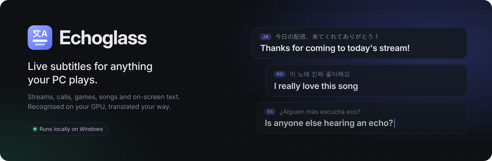
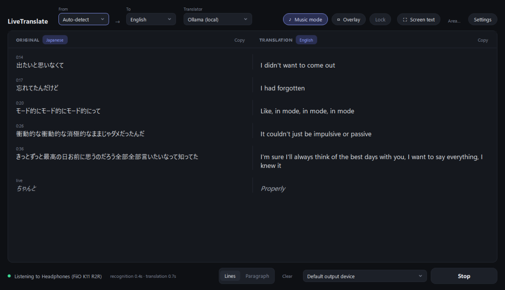
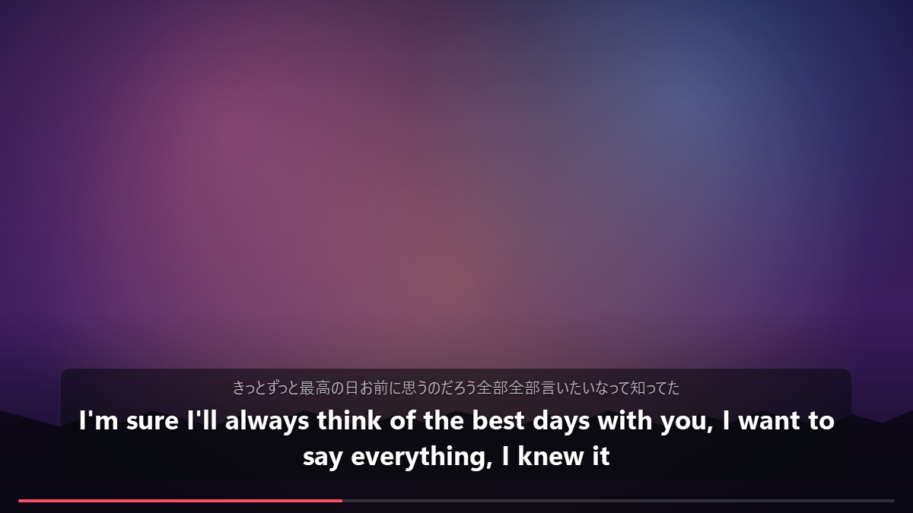
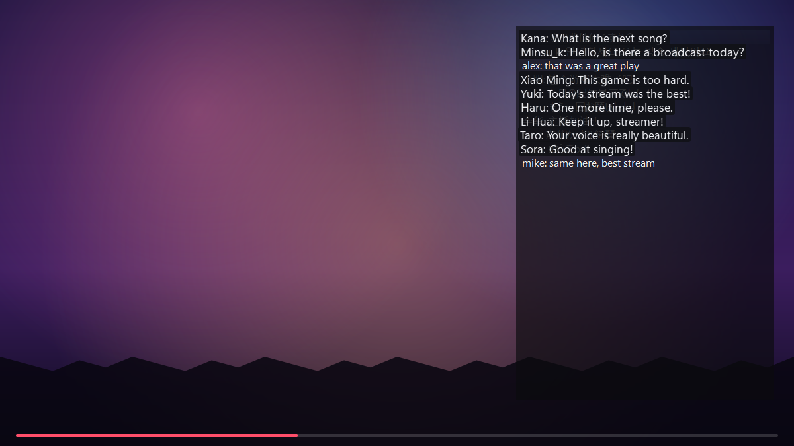
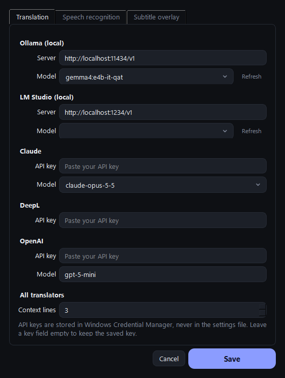
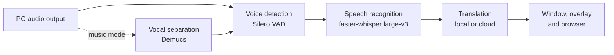

<p align="center">
  
</p>

<p align="center">
  <a href="https://github.com/RDELX/Echoglass/releases/latest"></a>
  <a href="https://github.com/RDELX/Echoglass/releases"></a>
  
  <a href="LICENSE"></a>
  
</p>

<p align="center">
  <b><a href="https://github.com/RDELX/Echoglass/releases/latest">Download for Windows</a></b>
  &nbsp;·&nbsp; <a href="#features">Features</a>
  &nbsp;·&nbsp; <a href="#getting-started">Getting started</a>
  &nbsp;·&nbsp; <a href="#translators">Translators</a>
  &nbsp;·&nbsp; <a href="#faq">FAQ</a>
</p>

Echoglass listens to whatever your PC is playing (a stream, a video call, a game, a song) and shows what's being said in your language, a second or two after it's spoken. It can also read text off your screen, like a live chat burned into a video, and translate it in place.

Speech recognition runs on your own graphics card. Translation runs on a local model through Ollama or LM Studio for free, or through OpenAI, DeepL or Claude with your own API key.

<p align="center">
  
</p>

## Features

**Any audio, any app.** Echoglass captures your PC's output directly, so it works with browsers, media players, Discord, games and anything else, with no extra cables or virtual audio devices.

**Subtitles on top of everything.** A floating subtitle bar sits over fullscreen video. Lock it and clicks pass straight through to whatever's underneath.

<p align="center">
  
</p>

**Live captions.** Sentences appear while they're still being spoken and settle into their final wording a moment later.

**Screen text translation.** Press <kbd>Ctrl</kbd>+<kbd>Shift</kbd>+<kbd>S</kbd>, drag a box around any text on screen, and each line is replaced with its translation, refreshed about twice a second. Handy for live chats, game menus and hard-coded captions.

<p align="center">
  
</p>

**Music mode.** Turn it on for songs and Echoglass separates the vocals from the instruments before recognising them, which makes lyrics far more accurate.

**Many languages.** Auto-detects the spoken language, or pick one: Japanese, Korean, Chinese, Spanish, French, German, Russian, Portuguese, Turkish, Arabic, Hindi and more. Translate into any of them.

**Chrome extension.** Select text on any web page, right-click, and it's replaced with the translation in place. You can also start and stop live translation from the browser toolbar.

**Stays out of the way.** Closes to the system tray, updates itself in the background (downloading only the files that changed), and keeps API keys in Windows Credential Manager rather than in a settings file.

## Getting started

### Requirements

- Windows 10 or 11 (64-bit)
- An NVIDIA graphics card with an up-to-date driver. Running both speech recognition and a local translation model works comfortably with 12 GB of video memory or more.
- Around 10 GB of free disk space for the speech model and GPU runtime
- For free local translation: [Ollama](https://ollama.com) or [LM Studio](https://lmstudio.ai)

### Install

1. Download `Echoglass-Setup-x.y.z.exe` from the [latest release](https://github.com/RDELX/Echoglass/releases/latest).
2. Run it. It installs for your user account only and doesn't need administrator rights.
3. The installer downloads the GPU runtime from [pytorch.org](https://pytorch.org) and, if you leave the box ticked, the Whisper speech model (about 3 GB) from [Hugging Face](https://huggingface.co/Systran/faster-whisper-large-v3). Every download is checksum-verified, and anything you already have is skipped.

### First run

1. Pick a translator. For a free local setup, install Ollama and pull a model:
   ```
   ollama pull gemma4:e4b-it-qat
   ```
   Then choose **Ollama (local)** in the Translator menu.
2. Leave **From** on Auto-detect and set **To** to your language.
3. Play something and press **Start** (<kbd>Ctrl</kbd>+<kbd>Enter</kbd>).

## Translators

| Translator | Cost | Runs on | Setup |
| --- | --- | --- | --- |
| **Ollama** | Free | Your PC | Install Ollama and pull a model |
| **LM Studio** | Free | Your PC | Load a model and start the local server |
| **OpenAI** | Pay per use | Cloud | Paste your API key in Settings |
| **DeepL** | Free tier available | Cloud | Paste your API key in Settings |
| **Claude** | Pay per use | Cloud | Paste your API key in Settings |

Translators get a few previous lines as context, so pronouns and running jokes come out right. You can change how many in **Settings > Translation**.

<p align="center">
  
</p>

## How it works



Audio is captured with WASAPI loopback, split into speech segments, and transcribed on the GPU. Each finished line is sent to the translator you picked along with a little context, then shown in the main window, the subtitle overlay, or both. Screen text translation uses OCR on the area you select and runs through the same translator.

## Keyboard shortcuts

| Shortcut | Action |
| --- | --- |
| <kbd>Ctrl</kbd>+<kbd>Enter</kbd> | Start or stop |
| <kbd>Ctrl</kbd>+<kbd>O</kbd> | Show or hide the subtitle overlay |
| <kbd>Ctrl</kbd>+<kbd>Shift</kbd>+<kbd>S</kbd> | Translate text on screen |
| <kbd>Ctrl</kbd>+<kbd>+</kbd> / <kbd>Ctrl</kbd>+<kbd>-</kbd> | Bigger or smaller text |
| <kbd>Ctrl</kbd>+<kbd>L</kbd> | Clear the transcript |
| <kbd>Alt</kbd>+<kbd>T</kbd> | Translate selected text (Chrome extension) |

## Chrome extension

1. In Echoglass, open **Settings > General**, allow the extension to connect, and open the extension folder.
2. In Chrome, go to `chrome://extensions`, turn on **Developer mode**, click **Load unpacked**, and choose that folder.
3. Select text on any page and right-click **Translate with Echoglass**, or press <kbd>Alt</kbd>+<kbd>T</kbd>. Alt+click a translation to bring the original back.

The extension only talks to the app on your own PC (`127.0.0.1`) and nothing else.

## Privacy

Audio never leaves your computer: speech recognition runs locally on your GPU. With Ollama or LM Studio, translation is local too and nothing is sent anywhere. With a cloud translator, only the recognised text is sent to that provider, using your own key. Echoglass has no accounts and no analytics. It contacts GitHub only to check for updates, which you can turn off in Settings.

## FAQ

**Does it work without an NVIDIA card?**
Not yet. Speech recognition needs CUDA to keep up in real time.

**Can I translate my microphone?**
Echoglass translates what your PC plays. To translate a call, it picks up the other side of the conversation.

**The first Start takes a while.**
The speech model loads into video memory the first time. If you skipped the model download in the installer, it downloads then (about 3 GB).

**Where are my settings?**
Settings are in `%APPDATA%\Echoglass` and models in `%LOCALAPPDATA%\Echoglass\models`. Uninstalling keeps both, so delete those folders by hand if you want them gone.

## Building from source

```powershell
git clone https://github.com/RDELX/Echoglass
cd Echoglass
py -3.12 -m venv .venv
.venv\Scripts\pip install torch torchaudio --index-url https://download.pytorch.org/whl/cu128
.venv\Scripts\pip install -r requirements.txt
.venv\Scripts\python run_app.py
```

`run_console.py` runs the audio pipeline in a terminal without the UI. To build the installer, run `packaging\build.ps1` (needs [PyInstaller](https://pyinstaller.org) in the venv and [Inno Setup](https://jrsoftware.org/isinfo.php)).

## Built with

[faster-whisper](https://github.com/SYSTRAN/faster-whisper) ·
[Silero VAD](https://github.com/snakers4/silero-vad) ·
[Demucs](https://github.com/facebookresearch/demucs) ·
[RapidOCR](https://github.com/RapidAI/RapidOCR) ·
[PyQt6](https://www.riverbankcomputing.com/software/pyqt/) ·
[PyAudioWPatch](https://github.com/s0d3s/PyAudioWPatch)

## License

Echoglass is released under the [MIT License](LICENSE). The speech model and libraries it downloads keep their own licenses.
